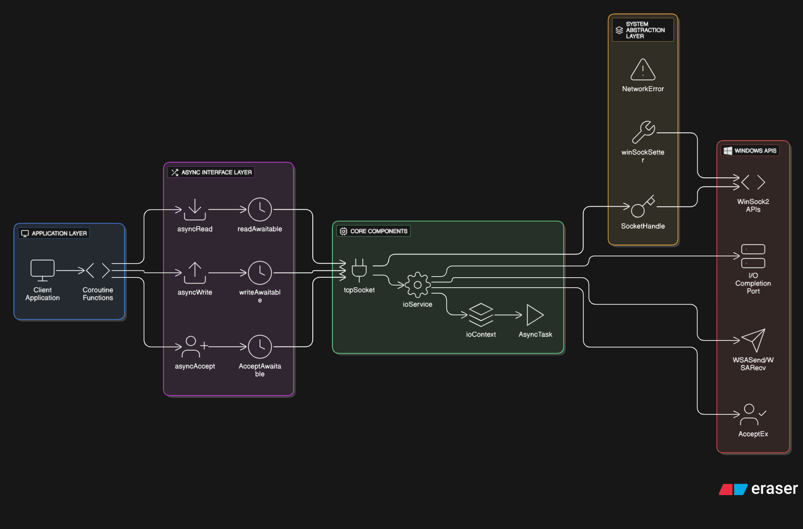

# Network Library Architecture Documentation

## Overview

This document describes a high-performance, asynchronous network library built for Windows platforms using modern C++20 coroutines and Windows I/O Completion Ports (IOCP). The library provides a clean, awaitable interface for TCP socket operations while leveraging the full power of Windows' asynchronous I/O capabilities.

## Architecture Diagram

<p align="center">
    
</p>


## Component Descriptions

### System Abstraction Layer

#### `winSockSetter`
- **Purpose**: RAII wrapper for WinSock library initialization
- **Functionality**: 
  - Initializes WinSock 2.2 on construction
  - Automatically cleans up on destruction
  - Throws `NetworkError` on initialization failure
- **Lifecycle**: Should be instantiated once per application

#### `SocketHandle`
- **Purpose**: RAII wrapper for Windows SOCKET handles
- **Features**:
  - Automatic socket cleanup on destruction
  - Move semantics (non-copyable)
  - Safe handle management with `release()` and `reset()`
- **Design Pattern**: Resource Acquisition Is Initialization (RAII)

#### `NetworkError`
- **Purpose**: Centralized exception handling for network operations
- **Inheritance**: Extends `std::system_error`
- **Usage**: Provides consistent error reporting across the library

### Core Components

#### `ioService`
- **Purpose**: Central I/O Completion Port manager and thread pool coordinator
- **Key Responsibilities**:
  - Creates and manages Windows IOCP handle
  - Maintains worker thread pool for asynchronous operations
  - Associates sockets with IOCP for event notification
  - Dispatches completion events to waiting coroutines
- **Thread Safety**: Uses atomic flags and thread-safe operations
- **Architecture**: Producer-consumer pattern with completion port

**Key Methods**:
- `associateSocket()`: Links socket to IOCP for async operations
- `postRead()`, `postWrite()`, `postAccept()`: Submit async operations
- `workerLoop()`: Thread function that processes completion events

#### `ioContext`
- **Purpose**: Manages state for individual asynchronous operations
- **Contains**:
  - Windows `OVERLAPPED` structure for async I/O
  - Coroutine handle for resumption
  - Operation-specific data (buffers, sockets, results)
- **Lifecycle**: Created per async operation, destroyed when operation completes

#### `tcpSocket`
- **Purpose**: High-level TCP socket abstraction
- **Features**:
  - RAII socket management
  - Automatic IOCP association
  - Move-only semantics
  - Integration with async operations
- **Design**: Composition over inheritance with `SocketHandle`

#### `AsyncTask`
- **Purpose**: Coroutine promise type for managing async task lifecycle
- **Functionality**:
  - Provides coroutine infrastructure
  - Handles exceptions in async operations
  - Manages coroutine handle lifetime
- **Pattern**: RAII for coroutine handles

### Async Interface Layer

#### Awaitable Classes
Each awaitable implements the C++20 coroutine interface:

##### `readAwaitable`
- **Purpose**: Makes socket read operations awaitable
- **Process**:
  1. `await_ready()`: Always returns false (never ready synchronously)
  2. `await_suspend()`: Submits WSARecv operation via ioService
  3. `await_resume()`: Returns `readResult` when operation completes

##### `writeAwaitable`
- **Purpose**: Makes socket write operations awaitable  
- **Process**:
  1. Prepares write buffer and context
  2. Submits WSASend operation via ioService
  3. Returns `writeResult` on completion

##### `AcceptAwaitable`
- **Purpose**: Makes socket accept operations awaitable
- **Process**:
  1. Creates new socket for incoming connection
  2. Submits AcceptEx operation via ioService
  3. Returns new `tcpSocket` instance on successful accept

#### Free Functions
- `asyncRead()`, `asyncWrite()`, `asyncAccept()`: Factory functions that create awaitable objects
- **Design**: Provide clean, functional interface to awaitable classes

## Data Flow and Interaction Patterns

### Asynchronous Operation Flow

<p align="center">
    
</p>

### Thread Architecture

<p align="center">
    
</p>
## Key Design Patterns

### RAII (Resource Acquisition Is Initialization)
- **Classes**: `winSockSetter`, `SocketHandle`, `AsyncTask`
- **Benefit**: Automatic resource cleanup, exception safety

### Move Semantics
- **Classes**: `SocketHandle`, `tcpSocket`, `AsyncTask`
- **Benefit**: Efficient resource transfer without copying

### Composition over Inheritance
- **Example**: `tcpSocket` contains `SocketHandle` rather than inheriting from it
- **Benefit**: Better encapsulation and flexibility

### Producer-Consumer
- **Implementation**: IOCP with worker threads
- **Benefit**: Scalable async I/O processing

## Performance Characteristics

### Scalability
- **Thread Pool**: Configurable worker threads (default: hardware concurrency)
- **Zero-Copy**: Direct buffer operations without intermediate copying
- **Async I/O**: Non-blocking operations allow high concurrency

### Memory Management
- **Smart Pointers**: `std::unique_ptr` for automatic cleanup
- **Stack Allocation**: Local objects use stack when possible
- **Buffer Management**: `std::span` for zero-copy buffer handling

### Error Handling
- **Exception Safety**: RAII ensures cleanup even during exceptions
- **Error Propagation**: Consistent error handling through `std::error_code`
- **System Integration**: Native Windows error codes preserved

## Usage Example

```cpp
// Initialize the library
winSockSetter winsock;
ioService service(4); // 4 worker threads

// Create server socket
tcpSocket server(service);
server.bindAndListen("127.0.0.1", 8080);

// Accept connections asynchronously
auto acceptConnection = []() -> AsyncTask {
    auto result = co_await asyncAccept(server);
    if (!result.error) {
        // Handle new connection
        auto client = std::move(result.nodeSocket);
        
        // Read data asynchronously  
        char buffer[1024];
        auto readResult = co_await asyncRead(*client, std::span(buffer));
        
        if (!readResult.error) {
            // Process received data
            std::span writeBuffer(buffer, readResult.bytesRead);
            auto writeResult = co_await asyncWrite(*client, writeBuffer);
        }
    }
};

// Start async operations
service.run();
```

## Dependencies and Requirements

### System Requirements
- **Platform**: Windows (Vista/Server 2008 or later)
- **Compiler**: C++20 compatible compiler (MSVC 2019+, Clang 10+)
- **Libraries**: ws2_32.lib, mswsock.lib

### C++ Features Used
- **Coroutines** (C++20): For async/await functionality
- **Concepts** (C++20): For type safety (implicit)
- **Smart Pointers** (C++11): For memory management
- **Move Semantics** (C++11): For efficient resource transfer
- **RAII**: For automatic resource management

## Future Enhancements

### Planned Improvements
- **Context Pool**: Reuse ioContext objects to reduce allocations
- **Connection Pool**: Implement connection pooling for clients
- **Metrics**: Add performance monitoring and statistics

### Optimization Opportunities
- **GetQueuedCompletionStatusEx**: Batch completion processing
- **Buffer Pool**: Pre-allocated buffer management
- **Custom Allocators**: Specialized memory allocation strategies
